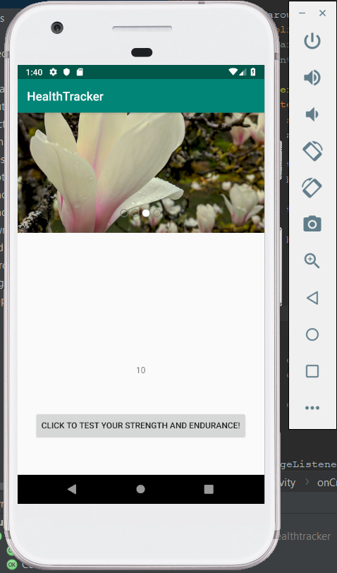
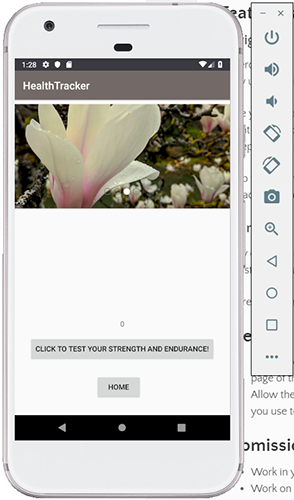

# healthtracker

## Day One Features:
1. Finger Exercises: Build finger strength and endurance with a button clicking exercises that displays the number of times the button has been clicked.
2. Inspiring Image Carousel: Display inspiring images and captions at the top of the page. Allow users to cycle through images with next and previous buttons, display image numbers.

## Day Two Features:
1. Navigation: Move the exercise to its own page with buttons to navigate two and back.
2. Styling: Apply consistent styling to all pages. 

## References:
1. <a href="https://www.4tocode.com/create-button-click-increment-counter-in-android/"> Click Counter </a>
2. <a href="https://github.com/sayyam/carouselview"> Image Carousel </a>
